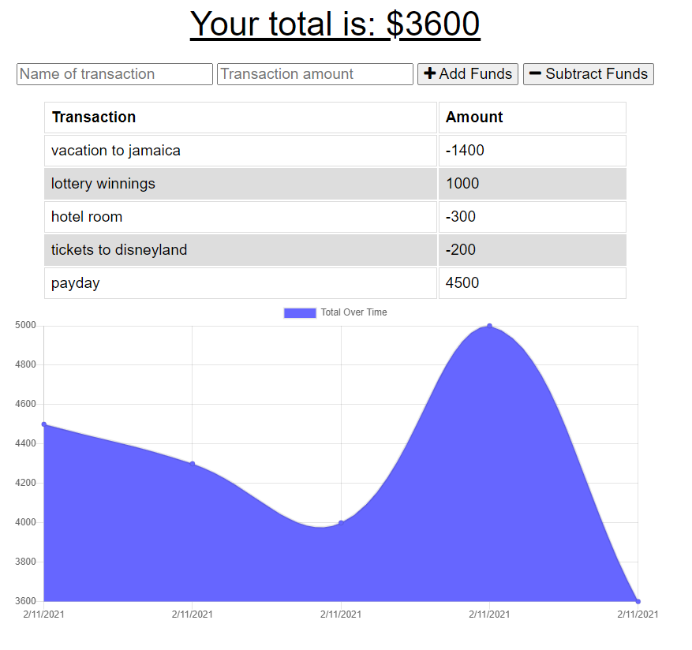

-->
[![Contributors][contributors-shield]][contributors-url]
[![Forks][forks-shield]][forks-url]
[![Stargazers][stars-shield]][stars-url]
[![Issues][issues-shield]][issues-url]
[![MIT License][license-shield]][license-url]
[![LinkedIn][linkedin-shield]][linkedin-url]


<!-- PROJECT LOGO -->
<br />
<p align="center">
  <a href="https://github.com/infiniteoo/homework_week_18_budget_tracker">
    
  </a>

  <h3 align="center">Budget Tracker</h3>

  <p align="center">
    Budget tracking application which allow for offline access and functionality utilizing Indexed DB as our local storage.
    <br />
    <a href="https://github.com/infiniteoo/homework_week_18_budget_tracker"><strong>Explore the docs »</strong></a>
    <br />
    <br />
    <a href="https://fast-inlet-48607.herokuapp.com/">View Demo</a>
    ·
    <a href="https://github.com/infiniteoo/homework_week_18_budget_tracker/issues">Report Bug</a>
    ·
    <a href="https://github.com/infiniteoo/homework_week_18_budget_tracker/issues">Request Feature</a>
  </p>
</p>


<!-- TABLE OF CONTENTS -->
<details open="open">
  <summary><h2 style="display: inline-block">Table of Contents</h2></summary>
  <ol>
    <li>
      <a href="#about-the-project">About The Project</a>
      <ul>
        <li><a href="#built-with">Built With</a></li>
      </ul>
    </li>
    <li>
      <a href="#getting-started">Getting Started</a>
      <ul>
        <li><a href="#prerequisites">Prerequisites</a></li>
        <li><a href="#installation">Installation</a></li>
      </ul>
    </li>
    <li><a href="#usage">Usage</a></li>
    <li><a href="#roadmap">Roadmap</a></li>
    <li><a href="#contributing">Contributing</a></li>
    <li><a href="#license">License</a></li>
    <li><a href="#contact">Contact</a></li>
    <li><a href="#acknowledgements">Acknowledgements</a></li>
  </ol>
</details>


<!-- ABOUT THE PROJECT -->
## About The Project



This budget tracking app allows the user to keep detailed records on their finances even if they are without periodic internet connectivity.  Utilizing Indexed DB, the user is able to input transactions even in the remotest of locations, and when internet connectivity is restored, the budget tracker will be automatically synced with the "cloud-based" remote database.


### Built With

[](https://aleen42.github.io/badges/src/node.svg)
[](https://aleen42.github.io/badges/src/eslint.svg)
[](https://aleen42.github.io/badges/src/javascript.svg)
[](https://aleen42.github.io/badges/src/github.svg)
[](https://aleen42.github.io/badges/src/npm.svg)
[](https://aleen42.github.io/badges/src/visual_studio_code.svg)


<!-- GETTING STARTED -->
## Getting Started

To get a local copy up and running follow these simple steps.

### Prerequisites

This is an example of how to list things you need to use the software and how to install them.
* npm
  ```sh
  npm install npm@latest -g
  ```

### Installation

1. Clone the repo
   ```sh
   git clone https://github.com/infiniteoo/homework_week_19_budget_tracker.git
   ```
2. Install NPM packages
   ```sh
   npm install
   ```


<!-- USAGE EXAMPLES -->
## Usage

Use this space to show useful examples of how a project can be used. Additional screenshots, code examples and demos work well in this space. You may also link to more resources.

_For more examples, please refer to the [Documentation](https://github.com/infiniteoo/homework_week_19_budget_tracker)_


<!-- ROADMAP -->
## Roadmap

See the [open issues](https://github.com/infiniteoo/homework_week_19_budget_tracker) for a list of proposed features (and known issues).


<!-- CONTRIBUTING -->
## Contributing

Contributions are what make the open source community such an amazing place to be learn, inspire, and create. Any contributions you make are **greatly appreciated**.

1. Fork the Project
2. Create your Feature Branch (`git checkout -b feature/AmazingFeature`)
3. Commit your Changes (`git commit -m 'Add some AmazingFeature'`)
4. Push to the Branch (`git push origin feature/AmazingFeature`)
5. Open a Pull Request


<!-- LICENSE -->
## License

Distributed under the MIT License. See `LICENSE` for more information.


<!-- CONTACT -->
## Contact

Troy Dorman - Twitter: [@doormant](https://twitter.com/doormant) - Email: troydorman@gmail.com

Project Link: [https://github.com/infiniteoo/homework_week_19_budget_tracker](https://github.com/infiniteoo/homework_week_19_budget_tracker)


<!-- MARKDOWN LINKS & IMAGES -->
<!-- https://www.markdownguide.org/basic-syntax/#reference-style-links -->
[contributors-shield]: https://img.shields.io/github/contributors/infiniteoo/homework_week_18_budget_tracker?style=for-the-badge
[contributors-url]: https://github.com/infiniteoo/repo/graphs/contributors
[forks-shield]: https://img.shields.io/github/forks/infiniteoo/homework_week_18_budget_tracker?style=for-the-badge
[forks-url]: https://github.com/infiniteoo/repo/network/members
[stars-shield]: https://img.shields.io/github/stars/infiniteoo/homework_week_18_budget_tracker?style=for-the-badge
[stars-url]: https://github.com/infiniteoo/repo/stargazers
[issues-shield]: https://img.shields.io/github/issues/infiniteoo/homework_week_18_budget_tracker?style=for-the-badge
[issues-url]: https://github.com/infiniteoo/repo/issues
[license-shield]: https://img.shields.io/github/license/infiniteoo/homework_week_18_budget_tracker?style=for-the-badge
[license-url]: https://github.com/infiniteoo/repo/blob/master/LICENSE.txt
[linkedin-shield]: https://img.shields.io/badge/-LinkedIn-black.svg?style=for-the-badge&logo=linkedin&colorB=555
[linkedin-url]: https://www.linkedin.com/in/t-wayne-doorman/
